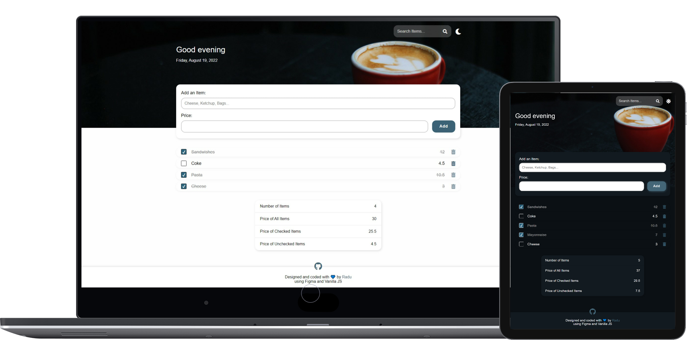
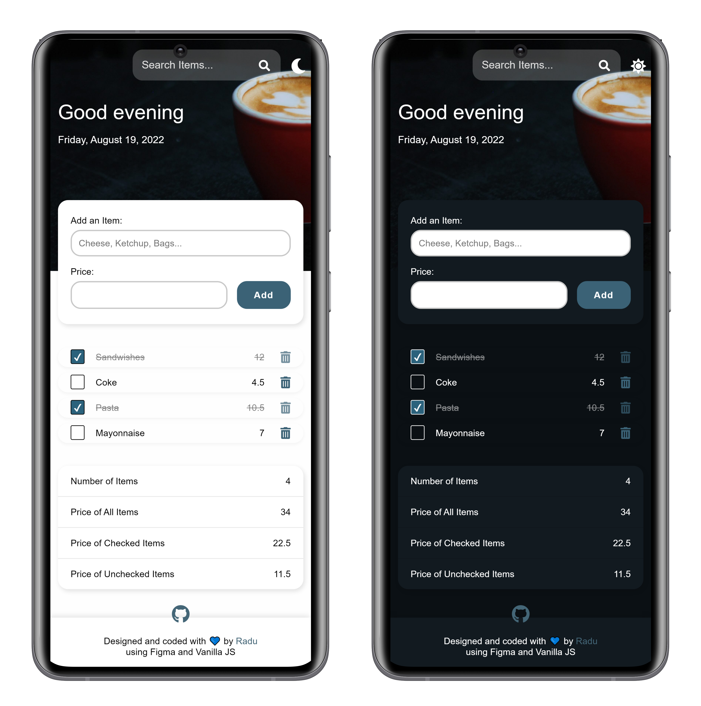

# Shopping List Application with prices (CRUD) made with Vanilla JavaScript

This projects consists on Shopping List App with an extra field for prices:

✅ Designed with [Figma](https://www.figma.com/)
✅ Coded with Vanilla JS from scratch

**View it live right here -> [https://radubulai.com/VanillaJS-ShoppingApp/](https://radualexandrub.github.io/VanillaJS-ShoppingApp/).**

<br/>

## Some nice features:

- Items that includes name, price and checked/unchecked
- Delete items with a fancy animation
- Check/Uncheck items on your list
- Update/Edit items on the go, just by clicking its name or its price
- Search items by name
- Display extra information that's updated on every add/edit/delete
    - Number of Items
    - Price of All Items
    - Price of Checked Items
    - Price of Unchecked Items
- Responsivess across all devices
- Includes dark mode

<br/>

## How to run

👉 Download and install [Visual Studio Code](https://code.visualstudio.com/)

```bash
git clone https://github.com/radualexandrub/VanillaJS-ShoppingApp vanilla-js-shopping-app
cd vanilla-js-shopping-app
code .
```

👉 Install the [Live Server Extension for VS Code](https://marketplace.visualstudio.com/items?itemName=ritwickdey.LiveServer)

👉 Press `CTRL+SHIFT+P` within VS Code and select "Open with Live Server"

👉 The app should open at [http://localhost:5500/index.html](http://localhost:5500/index.html) / http://127.0.0.1:5500/index.html

<br/>

## Screenshots





<br/>

## Small resources I used:

- [**All my personal notes from JavaScript tutorials**](https://github.com/radualexandrub/Study#javascript)
- [How to Search in an Array of Objects](https://usefulangle.com/post/3/javascript-search-array-of-objects)
- [How to change value of object which is inside an array](https://stackoverflow.com/questions/4689856/how-to-change-value-of-object-which-is-inside-an-array-using-javascript-or-jquer)
- [Javascript: Editing a list item](https://stackoverflow.com/questions/54125062/javascript-editing-a-list-item/54125361)
- [How to build a Todo List App with JavaScript](https://freshman.tech/todo-list/)

<br/>

## Data format

JSON:

```json
[
  {
    "id": "9ea585768ec3a",
    "name": "Sandwishes",
    "price": "12",
    "checked": false
  },
  {
    "id": "25bfe78760f37",
    "name": "Cheesecake",
    "price": "25",
    "checked": true
  },
  {
    "id": "efb642b1aef4",
    "name": "Lemonade",
    "price": "5",
    "checked": false
  }
]
```

<br/>

## License

Copyright (c) 2022 [Radu-Alexandru Bulai](https://radualexandrub.github.io/).

Released under [MIT License](./LICENSE.md).